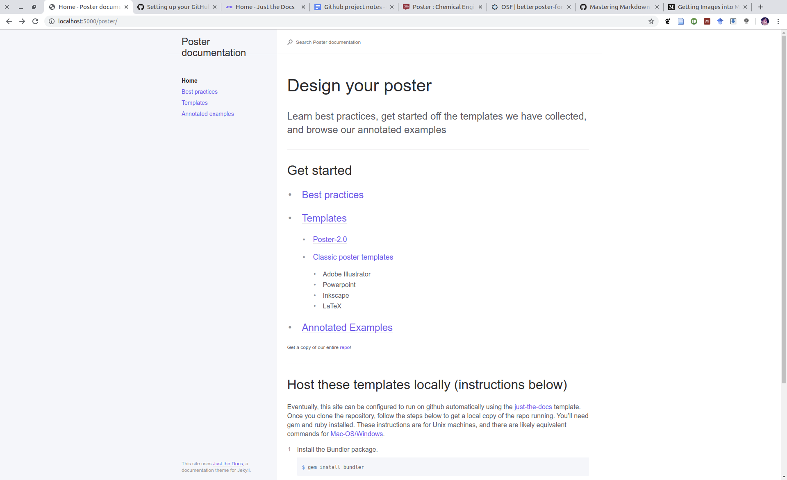

# Design your presentation
{: .fs-9 }

Learn best practices, build off our templates, and browse our annotated examples 
{: .fs-6 .fw-300 }

Compiled by Mica Smith, Krishna Shrinivas, Maxwell Nagarajan, and Michael Orella 
{: .fs-2 .fw-300 }

---
## Get started
{: .fs-7 }

  {: .fs-6 }
- [Best practices](best-practices)

  {: .fs-6 }
- [Templates](templates)

  {: .fs-6 }
- [Annotated Examples](annotated-examples)


{: .fs-2 }
Get a copy of our entire [repo](https://github.mit.edu/mit-chemecl/presentation)!

---

  {: .fs-7 }
## Host these templates locally (instructions below)

Eventually, this site can be configured to run on github automatically using the [just-the-docs](https://github.com/pmarsceill/just-the-docs) template. Once you clone
the repository, follow the steps below to get a local copy of the repo running.
You'll need gem and ruby installed. These instructions are for Unix machines,
and there are likely equivalent commands for [Mac-OS/Windows](https://help.github.com/en/articles/setting-up-your-github-pages-site-locally-with-jekyll).


1. Install the Bundler package.
```bash
$ gem install bundler
```
2. _Optional:_ Initialize search data (creates `search-data.json`)
```bash
$ bundle exec just-the-docs rake search:init
```
3. Run your local Jekyll server
```bash
$ bundle exec jekyll serve
```
4. Point your web browser to [http://localhost:4000](http://localhost:4000)

If all goes well, your webpage should look like:

