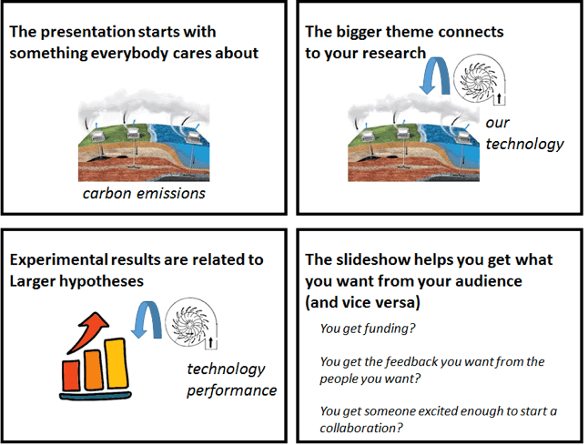

# Best practices for presentation design
{: .fs-8 }

## Criteria for Success

1. The presentation starts with the **larger motivation** for the work shown.
2. Experiments and their results are **connected to** the larger motivation.
3. Each slide tells a **message**.
4. Each slide gives **no more information than is required** to support the message.
5. The title text **stands on its own**, and most other text **supports the visuals**.
6. The audience will take away the **messages that achieve the presenter’s goals**.

## Presentation structure diagram

